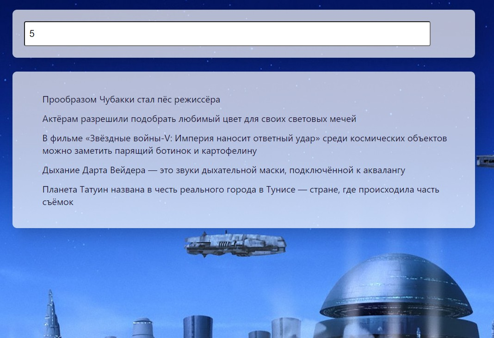

# Список задач

Учебный проект, предназначенный для получения опыта работы с методами массивов, local Storage, классами. Приложение позволяет добавлять задачи в список, помечать их, как выполдненные и удалять.

## **Описание проекта**

* Есть возможность добавления в список новых задач.
* Перед добавлением происходит проверка на то что поле с задачей не является пустым.
* После добавления задачи поле ввода очищается.
* Задачи в списке фильтруются (в начало списка помещаются новые задачи, в конец, выполненные).
* Есть возможность помечать задачи, как выполненные, а также удалять их.
* Адаптивная верстка для экранов 320px и выше

## **Стек технологий**

## [**Демо**](https://alekseeva-t-v.github.io/todo/)
